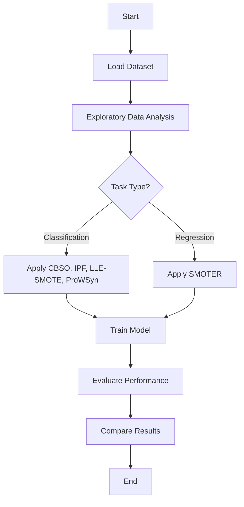

# Advanced Imbalanced Data Handling in Machine Learning

This project explores and evaluates several advanced oversampling and resampling techniques to handle class imbalance in both classification and regression problems. The methods used include:

- **CBSO (Class-Balanced Self-Organizing Oversampling)**
- **IPF (Instance Prototype Filtering)**
- **LLE-SMOTE (Locally Linear Embedding SMOTE)**
- **ProWSyn (Prototype Generation via Weighted Synergy)**
- **SMOTER (SMOTE for Regression)**

## 📊 Project Objectives

- Enhance model performance in highly imbalanced datasets.
- Compare and evaluate the effectiveness of multiple oversampling strategies.
- Provide a reproducible pipeline using Python and open-source libraries.

## 🧠 Methodology Overview

This project follows a structured data science pipeline including preprocessing, resampling, modeling, and evaluation. The resampling stage uses advanced methods suitable for both classification and regression tasks.

### Workflow Diagram



## 🧪 Techniques Used

### 1. CBSO (Class-Balanced Self-Organizing Oversampling)
Balances the dataset by using self-organizing maps to create synthetic samples around minority instances.

### 2. IPF (Instance Prototype Filtering)
A data cleaning technique that filters noisy samples using k-NN and consensus voting.

### 3. LLE-SMOTE
Combines Locally Linear Embedding (LLE) with SMOTE to preserve the intrinsic geometry of the data when generating new samples.

### 4. ProWSyn
A prototype generation method that creates synthetic samples based on local densities and class synergies.

### 5. SMOTER
Adaptation of SMOTE for regression problems, generating new synthetic targets using a weighted average of neighbor targets.

## 📦 Installation

Install required dependencies:

```bash
pip install -r requirements.txt
```

Ensure the following libraries are included:
- `scikit-learn`
- `imbalanced-learn`
- `smote-variants`
- `pandas`, `numpy`, `matplotlib`, `seaborn`

## 🚀 Usage

```bash
python main.py --dataset path/to/your/data.csv --task classification
```

Or for regression tasks:

```bash
python main.py --dataset path/to/your/data.csv --task regression
```

## 📈 Evaluation Metrics

- **Classification:** Accuracy, Precision, Recall, F1-Score, AUC-ROC
- **Regression:** MAE, MSE, RMSE, R²

## 📂 Project Structure

```
.
├── data/
├── notebooks/
├── src/
│   ├── preprocess.py
│   ├── resampling.py
│   ├── modeling.py
│   └── evaluation.py
├── main.py
└── README.md
```

## 📚 References

- Fernández et al., "SMOTE for Regression", 2018.
- Napierala et al., "ProWSyn: Prototype Generation via Weighted Synergy", 2016.
- Liu et al., "Locally Linear Embedding SMOTE", 2010.

---

*For professional or academic inquiries, please contact the project lead at [your-email@example.com].*
